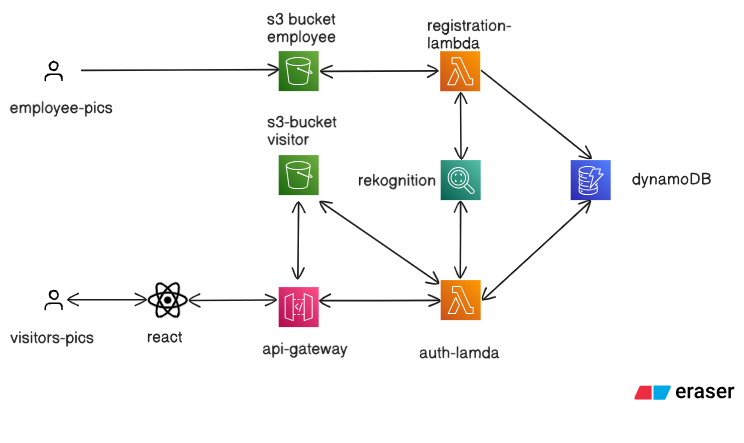

# Smart-Recognition-System
Building a facial recognition application on AWS using services like DynamoDB , Lambda , S3 buckets 
https://snehbhagat.github.io/Smart-Recognition-System/

## Architecture

The above diagram illustrates the complete architecture of the Smart Recognition System, showing the integration between various AWS services including DynamoDB for data storage, Lambda functions for processing, and S3 buckets for image storage.